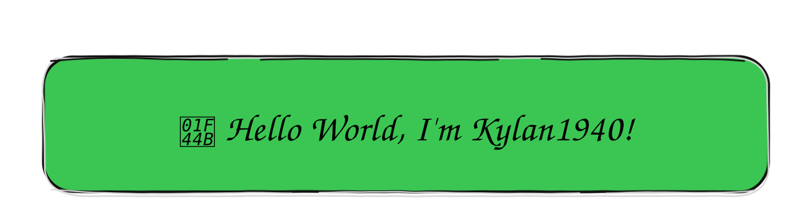

 

I'm an Informatics Engineering student interested in web development, software development, and building practical projects.

I mainly work with **React, Next.js, TypeScript, JavaScript, and Supabase**. I also have experience with **PHP, Python, Java, and Minecraft server development**.

Outside of development, I've spent several years running an online community and managing technical projects from development to maintenance. I'm interested in learning through real projects and continuously improving the things I build.

## 🌐 Connect

## 💻 Technologies

### Web Development

### Backend & Other Development

### Tools & Platforms

## 📊 GitHub Stats

